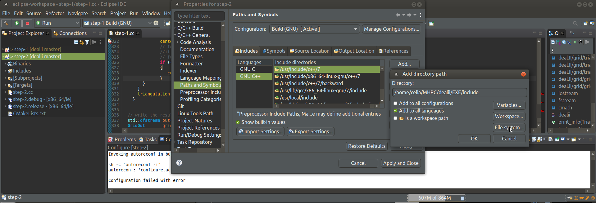
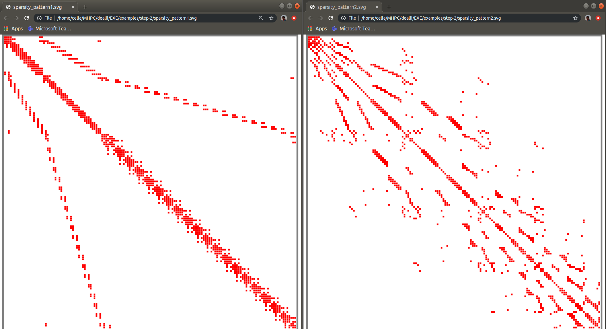
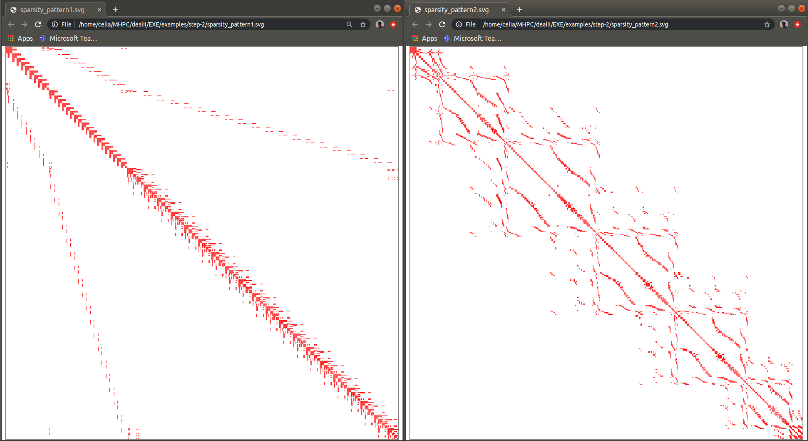
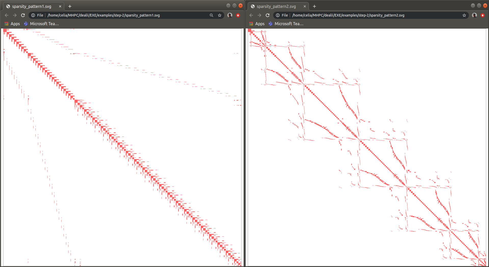
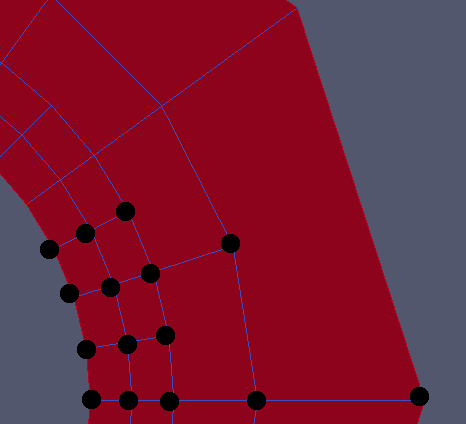
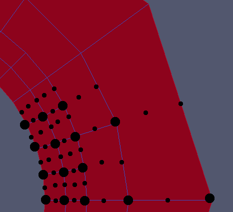

## Lab 2
### Creating a DoFHandler and visualising sparsity patterns

author: Luca Heltai (luca.heltai@sissa.it)

Some useful resources
https://www.dealii.org/current/doxygen/deal.II/step_2.html https://www.dealii.org/current/doxygen/deal.II/namespaceDoFRenumbering.html

### Using step-2 as a base:
#### 1. Compile and run this tutorial, and inspect at the output.

##### a) creating makefiles for eclipse IDE

```
cd examples/step-2
make distclean
cmake -DCMAKE_ECLIPSE_VERSION=4.14 -G"Eclipse CDT4 - Unix Makefiles" .
```

##### b) create the Makefile project with existing code


##### c) add path to deal II include directory 



##### d) configure eclipse to build the executable of the project


##### e) configure eclipse to run the executable of the project


#### 2. Look at the generated sparsity patterns (Firefox, for example)



As discussed in class, the pattern 1 (left side) has a larger bandwidth,  meaning that  every line needs data that are much farther away in memory (far from the diagonal) respect to the second (right hand side) pattern which has a lower bandwidth. Consequently the second pattern will allow much faster operations respect to the first pattern.

Documentation states that:

> [...] the polynomial degree of the element, which here is one (indicating a bi-linear element); this then
> corresponds to one degree of freedom for each vertex, while there are none on lines and inside the quadrilateral

#### 3. Investigate: 

- ##### How does the pattern change if you increase the polynomial degree from 1 to 2, or to 3?

  Documentations states that:

>  A value of, say, three given to the constructor would instead give us a bi-cubic element with one degree of freedom per vertex, two per line, and four inside the cell. In general, <code>FE_Q</code> denotes the family of continuous elements with complete polynomials (i.e. tensor-product polynomials) up to the specified order.

The order of the polynomial was changed in instruction:

```c++
  const FE_Q<2> finite_element(1);
```

for polynomial of degree 2:



and for degree 3: 



The size of the matrixes increases with the degree of the polynomial, this is visible in the size of the pixels that decrease with the increasing polynomial degree. The sparsity of the data remain unchanged by increasing the polynomial degree. It seems as well that the quantity of non-zero element per line does not increase with the polynomial degree.

- ##### How does the pattern change if you use a globally refined (say 3 times) unit square?

- ##### Are these patterns symmetric? Why/why not?

These patterns are symmetric, it can be seen from the symmetry respect to the diagonal of the matrix, and the reason for that is that these matrixes represents the link between the degrees of freedom, that depend on their vicinity, and is hence a symmetric relationship: if A is close enough to B, then B is close enough to A so that they interfere one on the other one.

- ##### How many entries per row in the sparsity pattern do you expect for a Q1 element (assuming four cells are around each vertex)?

Using a first degree polynomial i expect to have as many rows (and columns) as they are of vertex in the mes, because for first order polynomial there's only one degree of freedom per vetex. The mesh is done of 10 quadrants identicals as the one represented below, which has 15 (excluding those of the upper boundary that belong to the upper quadrant) so that i expect of matrix of size 150 x 150.

Then, as illustrated by the representation below, every vertex i sharing an element with other 5, 7, 8, 10 or 12 vertices (depending on the position of that vertex: in a more or less refined area, in the center of the grid or on the border of the domain). That number should then be the number of non-zero entries corresponding to the line (resp column) of the matrix associated to that given vertex.



- ##### Check that this is true for the mesh in (b) (look for row_length(i) and output them for each row).

- ##### Can you construct a 2d mesh (without hanging nodes) that has a row with more entries?

- ##### How many entries per row in the sparsity pattern are there for Q2 and Q3 elements, again assuming four cells around each vertex?

  For second order polynomials the matrix should then be 840x840 (84x10quadrants), according to the representation of the Q2 DoFs:



- ##### Print all entries for row 42 for the original renumbered sparsity pattern.

- ##### Renumber the DoFs using the `boost::king_ordering` algorithm. What does the sparsity pattern look like now?

#### 4. Additional tasks

- ##### Compute and output statistics like the number of unknowns, bandwidth of the sparsity pattern, average number of entries per row, and fill ratio.
- ##### Investigate the other appropriate DoF renumbering schemes. Which one produces the most banded structure?
- ##### Repeat the above for increasing refinement levels. Which is the most effcient scheme (lets say, in terms of bandwidth reduction versus computational time expended)? You can get an estimate of the time for this operation like this:

  `$ time ./step-2`
- ##### What happens if you change the mesh from 2d to 3d?
- ##### Investigate the sparsity patterns generated for other types of `FiniteElements` of varying order.