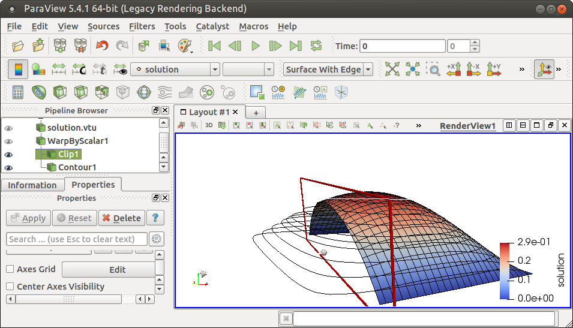
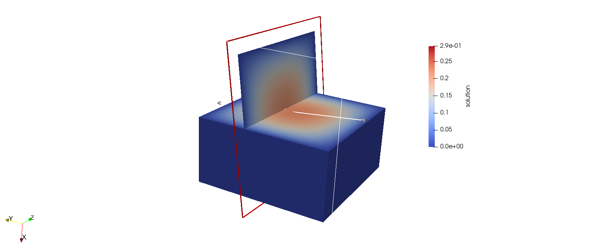
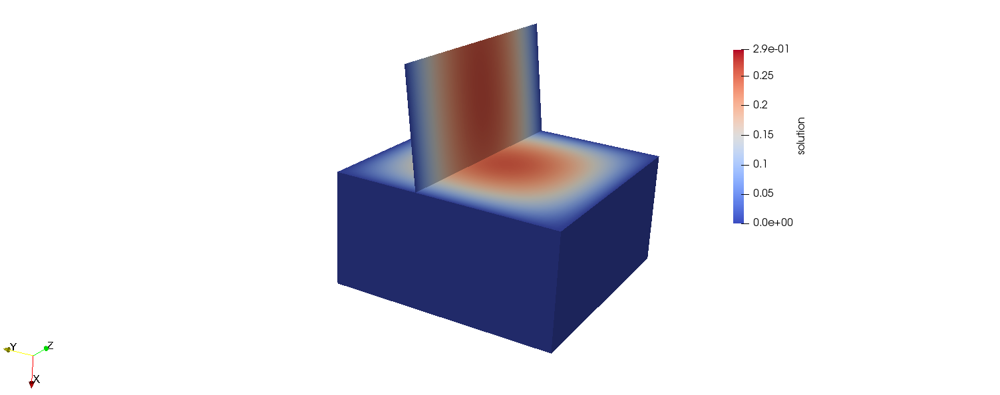
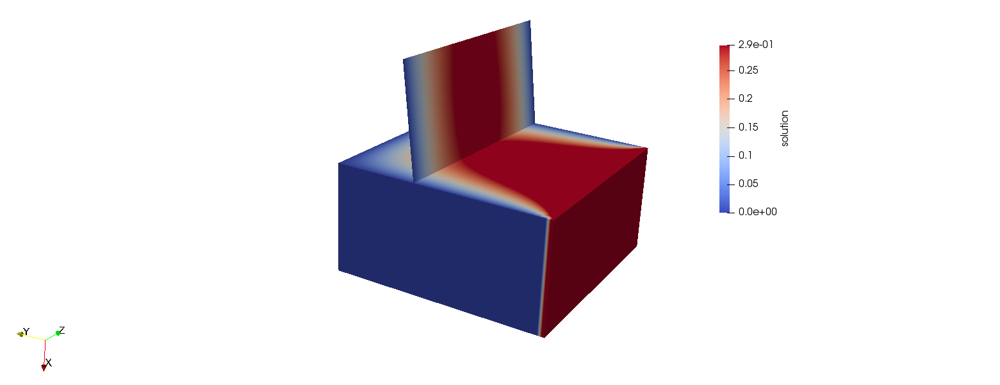
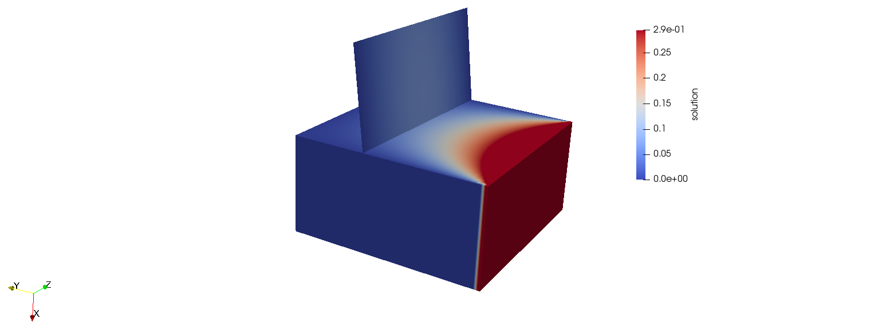

## Lab 2
### Creating a DoFHandler and visualising sparsity patterns

author: Luca Heltai (luca.heltai@sissa.it)

Some useful resources
https://www.dealii.org/current/doxygen/deal.II/step_3.html 

### Using step-3 as a base:
#### 1. Compile and run this tutorial, and inspect at the output.

- **Modify the code so that the problem is dimension-independent.**

- **Switch to vtk output and visualize in Paraview. Figure out how to warp the solution by the solution variable.**

  For the 2d mesh, setting on the bottom left properties box `Coloring` to be `solution`, setting `Representation` as `Surface With Edges`, then top bottom :  `Filters` ->  `Alfabetical `-> `Warp by scalar` and finally `Apply` in the bottom left properties box.

  Then, selecting 3d view and increasing the scale factor , adding a clip and a contour i played with this view:



and same thing in 3D:




- **Add a zero Neumann boundary condition to one edge of the domain. Assign this Neumann boundary the indicator 1. ** **Tip: Look at the instructions in “Modify the type of boundary condition” in the “Possibilities for extensions” section of the tutorial.**

To do so the line `triangulation.begin_active()->face(0)->set_boundary_id(1);` is inserted after `GridGenerator::hyper_cube (triangulation, -1, 1);`:

```c++
template<int dim>
void Step3<dim>::make_grid ()
{
  GridGenerator::hyper_cube (triangulation, -1, 1);
  //triangulation.begin_active()->face(0)->set_boundary_id(1);
  triangulation.refine_global (5);

  std::cout << "Number of active cells: "
            << triangulation.n_active_cells()
            << std::endl;
}
```

The graphical representation becomes now the following one, we can see that the solution is not anymore zero on the lower x-direction face of the domain.



- **Add a non-zero Dirichlet boundary condition to one edge of the domain**, **set the value to 0.5 for the boundary with indicator 1.** **Tip: Look at the instructions in “A slight variation of the last point” in the “Possibilities for extensions” section of the tutorial.**



In my case boundary id 1 refers to the first face with Neumann boundary condition, while the third face has id 2 and is the non-zero Dirichlet condition, that last one was set to value 0.5.

- **Change the setup to have f = 0. Compare this result to that where f is non-zero.**

  To do so the following piece of code was commented out:

  ```c++
            for (unsigned int i=0; i<dofs_per_cell; ++i)
              cell_rhs(i) += (fe_values.shape_value (i, q_index) *
                              1 *
                              fe_values.JxW (q_index));
  ```

  

#### 2. Additional tasks

- **Do “Convergence of the mean”. Can you see the order $h^2$?**

Documentations says:

> Convergence of the mean: A different way to see that the solution  actually converges (to something — we can't tell whether it's really the  correct value!) is to compute the mean of the solution. To this end,  add the following code to `LaplaceProblem::output_results`
>
> ```c++
> std::cout << "Mean value: "
> 
> std::cout << "Mean value: "
>           << VectorTools::compute_mean_value (dof_handler,
>                                               QGauss<2>(fe.degree + 1),
>                                               solution,
>                                               0)
>           << std::endl;
> ```

in our case, using `<dim>` instead of `<2>`, the output was, for the original 5 refinements:

```
Number of active cells: 32768
Number of degrees of freedom: 35937
DEAL:cg::Starting value 0.981130
DEAL:cg::Convergence step 112 value 9.68793e-13
Mean value: 0.214103
```

Now, to the convergence of the mean let's run the program changing the number of refinements:

Without refinement: 

```
Number of active cells: 1
Number of degrees of freedom: 8
DEAL:cg::Starting value 0.00000
DEAL:cg::Convergence step 0 value 0.00000
Mean value: 0.25
```

For 1 refinement:

```
Number of active cells: 8
Number of degrees of freedom: 27
DEAL:cg::Starting value 1.67705
DEAL:cg::Convergence step 2 value 2.55894e-16
Mean value: 0.230469
```

2 refinements:

```
Number of active cells: 64
Number of degrees of freedom: 125
DEAL:cg::Starting value 1.29452
DEAL:cg::Convergence step 15 value 2.16090e-14
Mean value: 0.221979
```

3 refinements:

```
Number of active cells: 512
Number of degrees of freedom: 729
DEAL:cg::Starting value 1.03824
DEAL:cg::Convergence step 30 value 4.31622e-13
Mean value: 0.21719
```

4 refinements:

```
Number of active cells: 4096
Number of degrees of freedom: 4913
DEAL:cg::Starting value 0.981066
DEAL:cg::Convergence step 57 value 5.01311e-13
Mean value: 0.214957
```

| r    | mean value | h=mv[r-1]-mv[r] | h[r]/h[r-1]      |
| ---- | ---------- | --------------- | ---------------- |
| 0    | 0.25       |                 |                  |
| 1    | 0.230469   | -0.019531       |                  |
| 2    | 0.221979   | -0.00849        | 2.30047114252062 |
| 3    | 0.21719    | -0.004789       | 1.77281269576113 |
| 4    | 0.214957   | -0.002233       | 2.14464845499323 |
| 5    | 0.214103   | -0.000854       | 2.61475409836072 |

I didn't observer the $h^2$ convergence, convergence is instead of the order of $h/2.5$.

- Increase the polynomial order (you need to increase all orders of the quadratures in the program!) and check the convergence of the mean now.
- Switch to an L-shaped domain and experiment with a combination of Dirichlet and Neumann boundary conditions. By experimentation, identify the faces adjacent to the re-entrant corner and apply Dirichlet conditions only there.
Tip: There is more than one way to generate such a grid using the built-in functions.