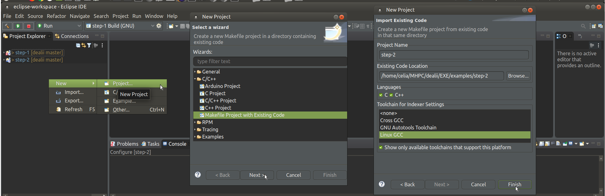
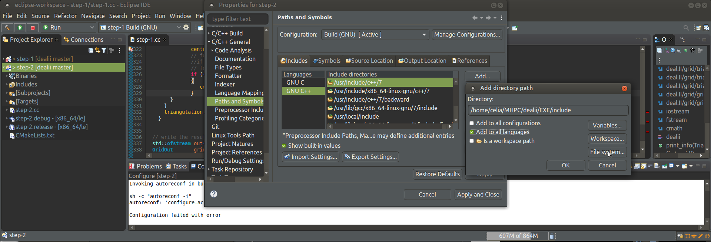
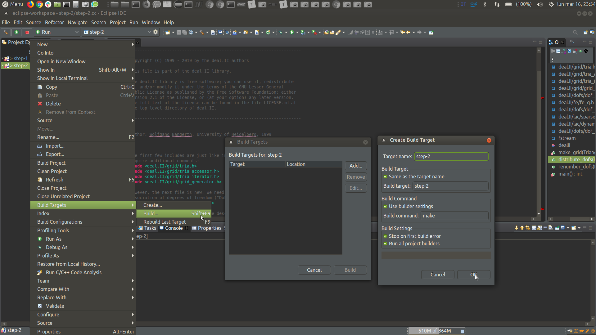
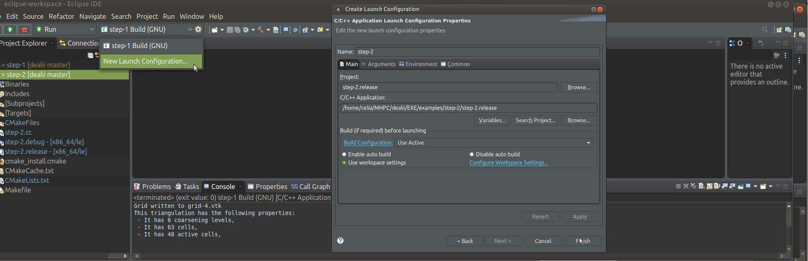

## How to create an eclipse project
##### a) creating makefiles and for eclipse IDE

```
cd examples/step-2
make distclean
cmake -DCMAKE_ECLIPSE_VERSION=4.14 -DDEAL_II_DIR=/home/celia/MHPC/dealii/EXE/lib/cmake/deal.II/ -G"Eclipse CDT4 - Unix Makefiles" .

```

##### b) create the Makefile project with existing code



##### c) add path to deal II include directory 



##### d) configure eclipse to build the executable of the project



Then, inside the same Build Targets, click on `Build` to create the first executable, to be referenced in next step.

##### e) configure eclipse to run the executable of the project



