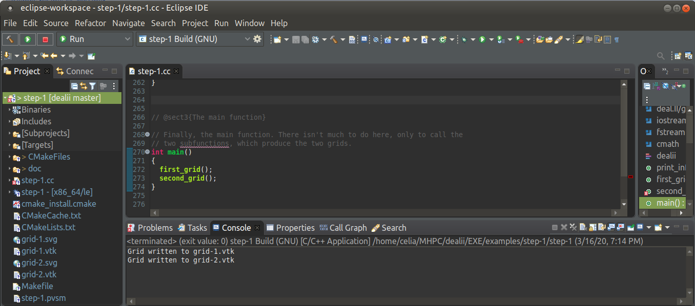
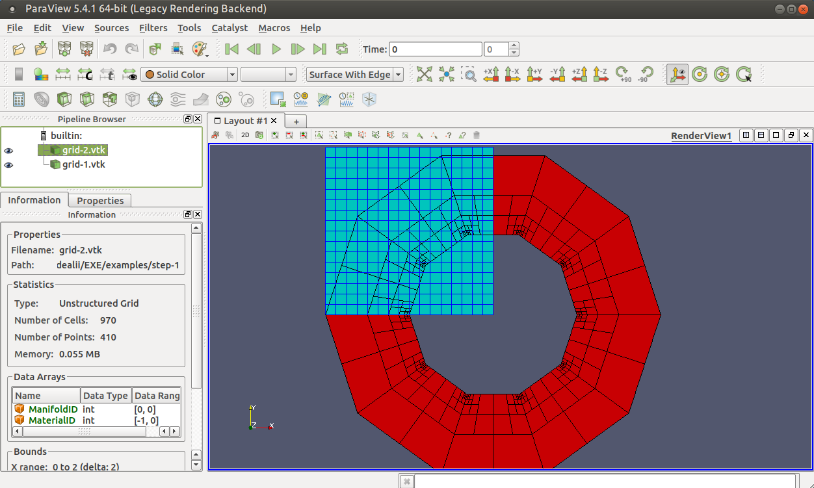
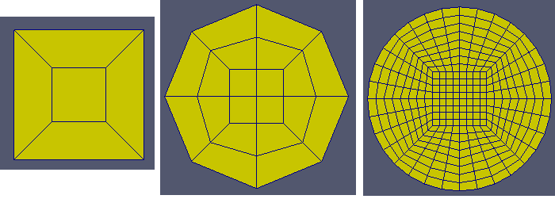
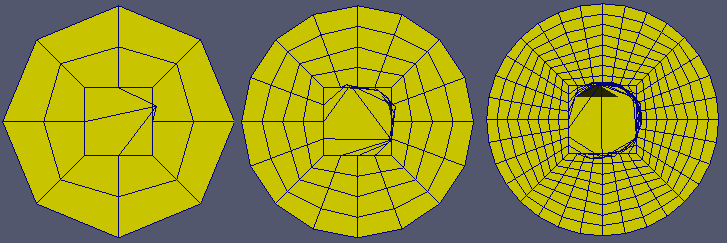

### Using step-1 as a base:

#### 1. Compile and run with Eclipse

*Compile and run this tutorial on the command line or inside a suitable IDE, and inspect the output.*



#### 2. Helper funtion

*Create a helper function that takes a reference to a Triangulation and prints the following information:*

- *number of levels*
- *number of cells*
- *number of active cells*

To do so the following function was created:

```c++
void print_info( Triangulation<2> *triangulation)
{
	std::cout << "This triangulation has the following properties:" << std::endl;
	std::cout << " - It has "<< triangulation->n_levels() << " coarsening levels, " << std::endl;
	std::cout << " - It has "<< triangulation->n_cells() << " cells, " << std::endl;
	std::cout << " - It has "<< triangulation->n_active_cells() << " active cells, " << std::endl << std::endl;
}
```

and called in the `first_frid` and `second_grid` functions by:

```c++
  print_info(&triangulation);
```

#### 3. Test this with all of your meshes.

The helper function outputs the following:

```
Grid written to grid-1.vtk
This triangulation has the following properties:

- It has 5 coarsening levels, 
- It has 341 cells, 
- It has 256 active cells, 

Grid written to grid-2.vtk
This triangulation has the following properties:

- It has 6 coarsening levels, 
- It has 1250 cells, 
- It has 940 active cells, 
```

For the following grids:


#### 4. Modifying an existing meshing function

- *Immediately after creating a mesh, call its method `reset_all_manifolds()`. What happens now?*

> In mathematics, a <u>manifold</u> is a <u>topological space</u> that locally resembles Euclidean space near each point. [...] In topology and related branches of mathematics, a <u>topological space</u> may be defined as a set of points, along with a set of neighbourhoods for each point, satisfying a set of axioms relating points and neighbourhoods. 

According to the documentation this operation replaces the manifold object given before by a straight manifold approximation.

Calling the `reset_all_manifolds()` method for grid 1 didn't change anything, probably because that grid is purely regular and orthogonal so that the approximation is identical as the original manifold object defined by `  GridGenerator::hyper_cube(triangulation);`

Instead for the second grid , calling the `reset_all_manifolds()` method before grid refinement leads to many changes, illustrating that informations on the respective locations of the nodes was lost, leading to a different refinement as the one expected. 



- *Output mesh two as an `svg` file instead of `eps`. Open it in a browser to display it.*

#### 5. Creating a mesh from scratch

- Generate a circle using `GridGenerator::hyper_ball()` in 2d (add a function `third_grid()` to `step-1`)

```c++
  const Point<2> center(1.0, 0);
  const double   radius = 0.45;
  GridGenerator::hyper_ball(
    triangulation, center, radius);
  triangulation.refine_global(1);
```

Doing zero, 1 or 3 local refinements bring the following:



- *Use a `SphericalManifold` everywhere, only on the boundary, or on all cells except the center cell and refine the mesh globally twice. Can you understand what happens in the center cell?*

Using a Spherical Manifold (adding boolean `1` to the arguments of the hyper_ball method) leads to the following meshes for respectively 1, 2 and 3 refinements. What happens is that during the first refinement, the central node gets mis-placed due to the manifold approximation.



- *Set the output format of the previous example to vtk and inspect the mesh in Paraview.*

Already done

- *Create an image of an L-shape domain with one global refinement.*

This was done for an Lshape with left=-1, right=1, the first green shape on the image below represents this l-shape with one global refinement.

- *Inspect the mesh in Paraview.*

- *Refine the L-shaped mesh adaptively:*

  - *Refine all cells with the distance between the center of the cell and re-entrant corner is smaller than 0.3.*

  The second green shapes is the result for 5 adaptative refinements for distance to the center < 0.3

  - *Refine exactly at the re-entrant corner (i.e. those with the corner as a vertex) several times.*

  The  third green shapes is the result for 5 adaptative refinements at the re-entrant corner 

