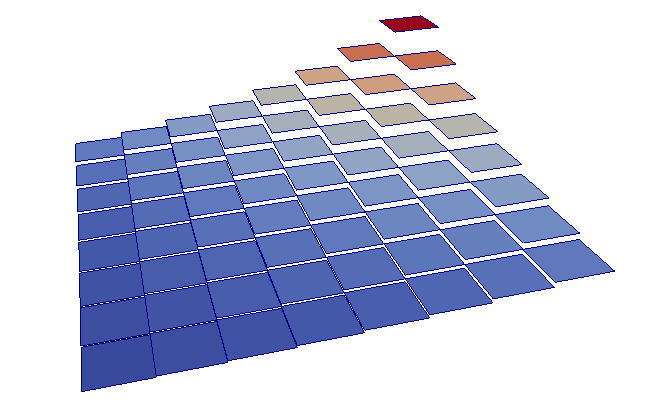
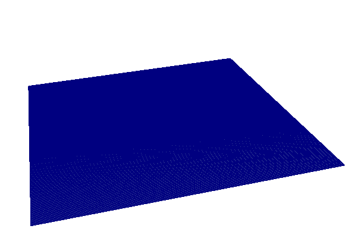

## step-3to5 : Global and local error computation and estimation
The transformation of step 3 to step 5 is made in`step-3to5.cc` which implements the problem posed in step 3, plus  the computation and extraction of the norms, starting from 3 initial refinements, and performing 6 more refinements, for the functions   

```c++
exact_solution("exp(x)*exp(y)")
exact_rhs_function("-2*exp(x)*exp(y)")
```

the output is :

```
Number of active cells: 64
--------------- cycle 0 --------------
Number of degrees of freedom: 81
DEAL:cg::Starting value 12.7761
DEAL:cg::Convergence step 21 value 1.00330e-13
L2 norm of error : 0.0424442
H1 norm of error : 0.372436
Mean value: 1.39726
Number of active cells: 256
--------------- cycle 1 --------------
Number of degrees of freedom: 289
DEAL:cg::Starting value 19.8872
DEAL:cg::Convergence step 46 value 3.72024e-13
L2 norm of error : 0.010645
H1 norm of error : 0.185369
Mean value: 1.38514
Number of active cells: 1024
--------------- cycle 2 --------------
Number of degrees of freedom: 1089
DEAL:cg::Starting value 29.0534
DEAL:cg::Convergence step 93 value 7.25182e-13
L2 norm of error : 0.0026634
H1 norm of error : 0.0925771
Mean value: 1.38211
Number of active cells: 4096
--------------- cycle 3 --------------
Number of degrees of freedom: 4225
DEAL:cg::Starting value 41.5333
DEAL:cg::Convergence step 187 value 8.16297e-13
L2 norm of error : 0.000665986
H1 norm of error : 0.0462751
Mean value: 1.38135
Number of active cells: 16384
--------------- cycle 4 --------------
Number of degrees of freedom: 16641
DEAL:cg::Starting value 58.9566
DEAL:cg::Convergence step 371 value 9.86982e-13
L2 norm of error : 0.000166505
H1 norm of error : 0.0231359
Mean value: 1.38116
Number of active cells: 65536
--------------- cycle 5 --------------
Number of degrees of freedom: 66049
DEAL:cg::Starting value 83.4941
DEAL:cg::Convergence step 739 value 9.46292e-13
L2 norm of error : 4.16268e-05
H1 norm of error : 0.0115677
Mean value: 1.38111
Number of active cells: 262144
cells dofs    u_L2_norm      u_H1_norm    
   64    81 4.245e-02    - 3.724e-01    - 
  256   289 1.065e-02 2.17 1.854e-01 1.10 
 1024  1089 2.663e-03 2.09 9.258e-02 1.05 
 4096  4225 6.660e-04 2.04 4.628e-02 1.02 
16384 16641 1.665e-04 2.02 2.314e-02 1.01 
65536 66049 4.163e-05 2.01 1.157e-02 1.01 
```





### Additionals:

 Adding a timer using `TimerOutput` class through `#include <deal.II/base/timer.h>` in `step-3to5.cc`

```c++
#include <deal.II/base/timer.h>
[...]
  // declare timer class:
  TimerOutput timer;
[...]
  // initialize timer with the string of the output we want,
  timer(std::cout, TimerOutput::summary, TimerOutput::cpu_and_wall_times)
[...]
  {TimerOutput::Scope timer_section(timer, "Make grid");
  [...] 
  }
    {TimerOutput::Scope timer_section(timer, "setup_system");
  [...] 
  }
    {TimerOutput::Scope timer_section(timer, "assemble_system");
  [...] 
  }
    {TimerOutput::Scope timer_section(timer, "solve");
  [...] 
  }
  
[...]
```

output is :

```
+---------------------------------------------+------------+------------+
| Total CPU time elapsed since start          |      52.7s |            |
|                                             |            |            |
| Section                         | no. calls |  CPU time  | % of total |
+---------------------------------+-----------+------------+------------+
| Make grid                       |         1 |   0.00769s |         0% |
| assemble_system                 |         6 |      3.25s |       6.2% |
| compute_error                   |         6 |      8.38s |        16% |
| compute_error_from_exact        |         6 |      13.2s |        25% |
| output_results                  |         6 |       5.2s |       9.9% |
| output_table                    |         1 |  0.000611s |         0% |
| refine_grid                     |         6 |      6.56s |        12% |
| setup_system                    |         6 |      0.84s |       1.6% |
| solve                           |         6 |      15.3s |        29% |
+---------------------------------+-----------+------------+------------+

+---------------------------------------------+------------+------------+
| Total wallclock time elapsed since start    |      37.9s |            |
|                                             |            |            |
| Section                         | no. calls |  wall time | % of total |
+---------------------------------+-----------+------------+------------+
| Make grid                       |         1 |    0.0048s |         0% |
| assemble_system                 |         6 |      3.24s |       8.6% |
| compute_error                   |         6 |      8.37s |        22% |
| compute_error_from_exact        |         6 |      13.2s |        35% |
| output_results                  |         6 |      4.08s |        11% |
| output_table                    |         1 |  0.000614s |         0% |
| refine_grid                     |         6 |      6.44s |        17% |
| setup_system                    |         6 |     0.631s |       1.7% |
| solve                           |         6 |      1.98s |       5.2% |
+---------------------------------+-----------+------------+------------+
```

