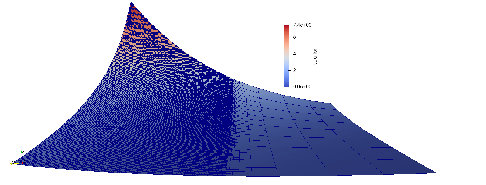
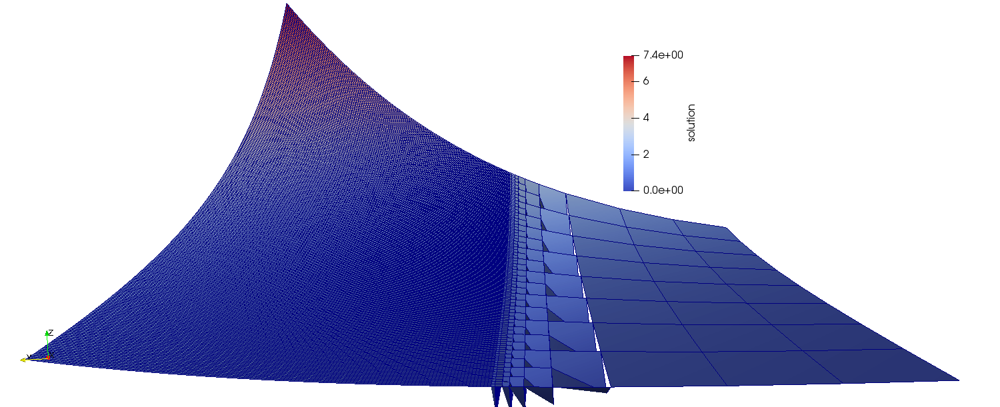
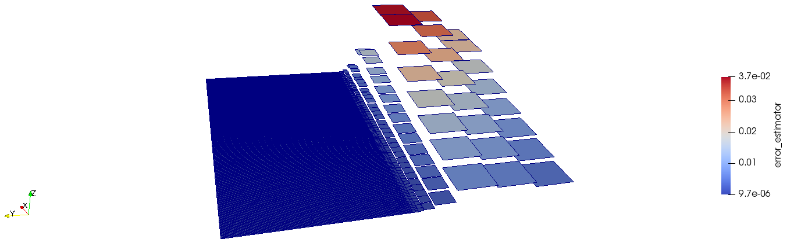
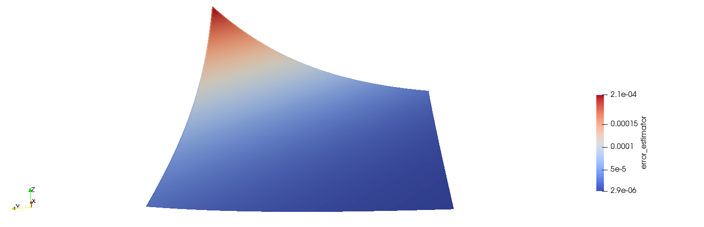
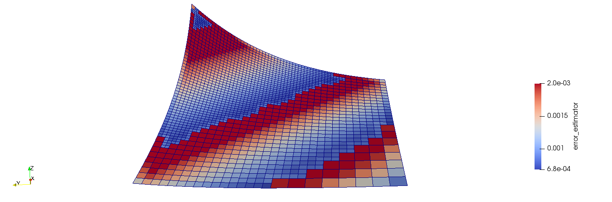

# step-3to6 : Adaptive Mesh Refinement (Lecture 6)

- Hanging nodes
- a posteriori error estimation using **Kelly error indicator**
- Error-based refinement marking


The transformation of step 3to5 to step 6 is made in`step-5to6.cc` which implements the problem posed in step 5, plus  the ...

### step-3to6-hanging-nodes-only.cc : 

This source code implements the consideration of the hanging nodes.

To observe the effects of the various steps, a local refinement was introduced, and the resulting solution visualized with paraview:



if the `constraints.distribute(solution);` is commented-out, as expected the solution is consistent on the hanging nodes added at every successive refinement.




### step-3to6-adding-Kelly-error.cc : 

using the same local refinement as above, the error_estimator field grows proportionally to the amplitude of the solution and the size of the cell (in the next fig the warping by scalar is made on the error_estimator)



while with the global refinement the expected dependency on the solution intensity is observed (plotting warp by `solution`, edges hided because with 3 initials + other 5 cycles of refinement they are too dense to see the colormap) : 



and the error tables indicate:

```
cells dofs    u_L2_norm      u_H1_norm    
   64    81 4.245e-02    - 3.724e-01    - 
  256   289 1.065e-02 2.17 1.854e-01 1.10 
 1024  1089 2.663e-03 2.09 9.258e-02 1.05 
 4096  4225 6.660e-04 2.04 4.628e-02 1.02 
16384 16641 1.665e-04 2.02 2.314e-02 1.01 
65536 66049 4.163e-05 2.01 1.157e-02 1.01 
```

### step-3to6-final_version_with_error_based_refinement.cc : 

Using finally the refinement based on the Kelly error_estimator (plotting warp by `solution`) :



and the error tables indicate:

```
cells dofs   u_L2_norm      u_H1_norm    
   64   81 4.245e-02    - 3.724e-01    - 
  127  156 1.665e-02 2.86 2.226e-01 1.57 
  253  296 1.062e-02 1.40 1.593e-01 1.05 
  502  563 4.917e-03 2.40 1.109e-01 1.13 
  997 1086 2.505e-03 2.05 7.852e-02 1.05 
 1984 2111 1.199e-03 2.22 5.522e-02 1.06 
```

The convergence if the H1 norm is of the same order as the one of the global refinement, but using marked-cells based on the estimated error the number of cells is only 2000 against the 65000 cells of the globally refined grid.

The L2 norm of the marked-cells-refinement case is instead larger of 2 orders of magnitude respect to the globally refined-case, but is anyway smaller by 1 order of magnitude respect to the L2 norm of the third global refinement cycle that presents anyway twice the number of cells.

These tests showed how accurate and important can be a good management of the refinement of the cells.


## Using step-5 as a base (or your previously modified step-3):

1. Solve the problem $-\Delta u(x) = f(x) \text{ in } [0, 1]^2$ , with $u(x) = g(x)$ on $\partial \Omega$, and
	- Set the boundary conditions $g(x)$ and the forcing function $f(x)$ to get the manufactured solution $u(x) = \sin(\pi x_1) \cos(\pi x_2)$.
	- Make sure the L2 errors are converging.
	Tip: Look at the `VectorTools::integrate_difference` function.
	
	- Use the `KellyErrorEstimator` to predict the regions of the geometry where the solution approximation is inaccurate. Visualise this error using Paraview. Do you observe any correlation between the gradient of the solution and the estimated local solution error?
	Tip: Use a different quadrature rule to prevent super-convergent effects when using the `KellyErrorEstimator`.
	- Perform local cell marking and refinement using the cell-based estimated error. For this, the logic of the refine_mesh function must be modified.
	
2. Additional tasks
	- Compare the convergence rates (number of DoFs versus the solution error, best viewed in a log-log plot) when using global refinement and when using local refinement with the Kelly error estimator.
	- Investigate the influence of the coarsening and refinement parameters on the solution accuracy.
	- Investigate the effect of changing the polynomial order for the solution ansatz on the solution accuracy.
	- Integrate a non-constant coefficient into the governing equation, i.e. solve the heterogeneous Poisson equation
	$-\nabla\cdot(k(x)\nabla u(x)) = f(x)$ in $\Omega$
	where $k(x)$ represents some material parameter. Repeat the calculation of the error using the `KellyErrorEstimator`, while taking this spatially dependent coefficient into consideration. 
    Tip: Look at the documentation for the `KellyErrorEstimator` before deciding on how to implement $k(x)$
    - Choose $k(x)$ to be spatially discontinuous. Do you observe any correlation between the location of the material discontinuity and the estimated local solution error? What influence does this have on the location of the refined cells?
    Tip: Verify your conclusions by looking to the results of `step-6`.
    Further information can be found in the discussion “Playing with the regularity of the solution” in the “Possibilities for extensions” section of step-6.